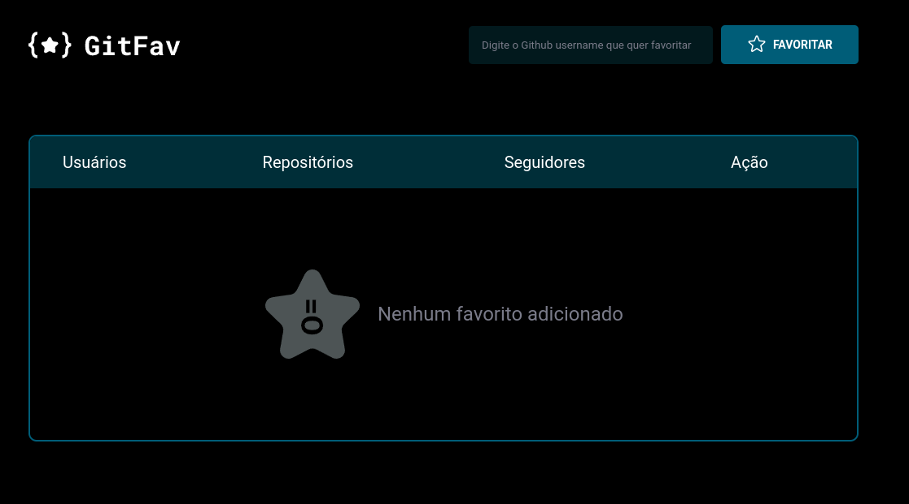

<strong><h1 align="center"> ⭐ GitFav</h1></strong>

## 📝 O que foi abordado nesse desafio:

- Requisição API Github
- Async
- Promise
- SPA
- Consumindo API do GithuB
- Programação Orientada a Objetos (POO)
- Criando HTML pelo JavaScript
- Imutabilidade
- LocalStorage
- Async Await Promises
- Fluxo da aplicação com Try, Catch e Throw

## 📄 Link do site
-

## 🚀 Tecnologias

Esse projeto foi desenvolvido com as seguintes tecnologias:

- HTML
- CSS
- JavaScript
